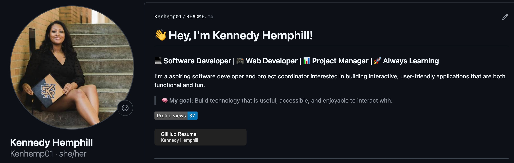
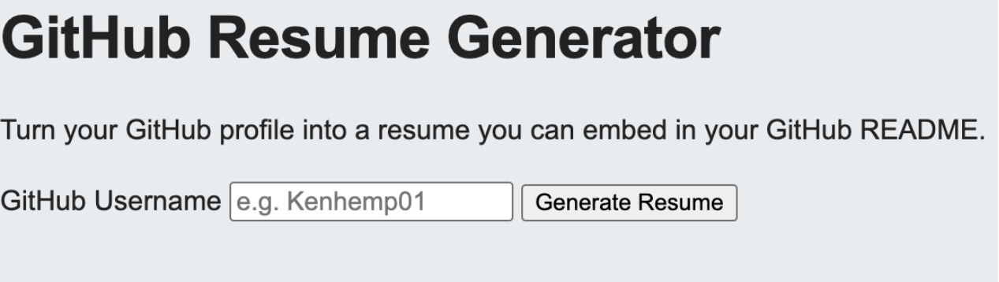

# GitHub Resume Generator


## ✨ What is it?

GitHub Resume Generator uses information from your GitHub profile and its repositories to create a resume-style webpage. The project uses the user's GitHub username to retrieve their profile, most important projects, programming languages, and GitHub activity. The user can add a link to their generated resume directly to their README for display.




## 🚀 How to Add Your GitHub Resume

There are two ways to add your resume to your profile.

### Option 1: Use the Resume Generator 
1. [Open the Github Resume Generator.](https://github-resume-6piy.onrender.com/)
2. Enter your GitHub username.
3. Select Generate Resume.
4. The generator will create your resume page.
5. Copy the Markdown code provided on the embed page.
6. Paste the Markdown into your GitHub profile README.



### Option 2: Add Your Username Manually

Add the code below to your README to generate your resume.

```
 [](https://github-resume-6piy.onrender.com/resume/yourusername)
```
Replace *'yourusername'* text with your own GitHub username.

## 📄 What the Resume Includes

The generated resume currently uses information available through GitHub, including:

### Profile
- Name
- GitHub username
- Profile picture
- Bio
- Link to GitHub profile
### Technical Skills
- Programming languages detected from repositories
### GitHub Activity
- Number of repositories
- Number of programming languages
- Total stars
- Total forks
- Recently updated repositories
### Featured Projects
- Repository name
- Project description
- Programming languages
- Repository topics
- Stars
- Last updated date
- Link to the repository

## 🛠️ Technologies

-  JavaScript
-  Node.js
-  HTML
-  CSS
-  GitHub REST API
-  GitHub Actions
-  Render

## 🚧 Future Improvements

### Better Resume Generation
- Improve programming language analysis
- Add contribution activity
- Display GitHub contribution history

### Resume Customization
- Different layouts
- Light/dark mode
- Add printing option

### Performance and Reliability
- Add caching to reduce GitHub API requests
- Improve handling of GitHub API rate limits

## 👤 Author

Created by Kennedy Hemphill.

GitHub: @Kenhemp01


